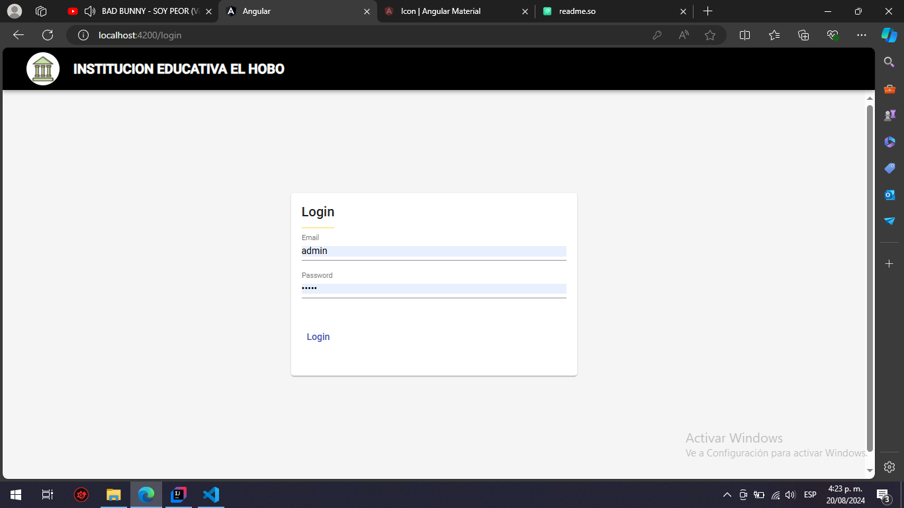
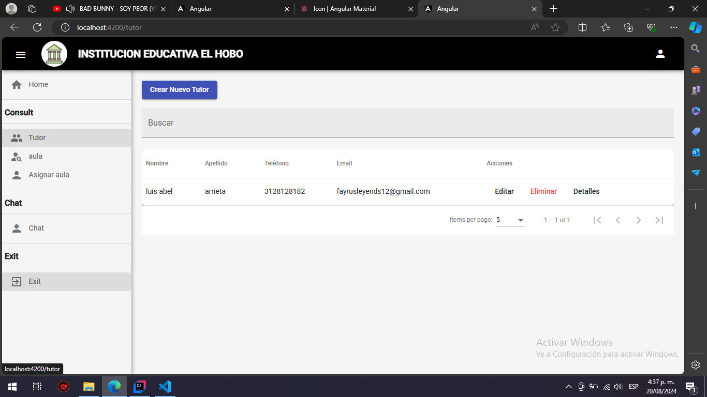
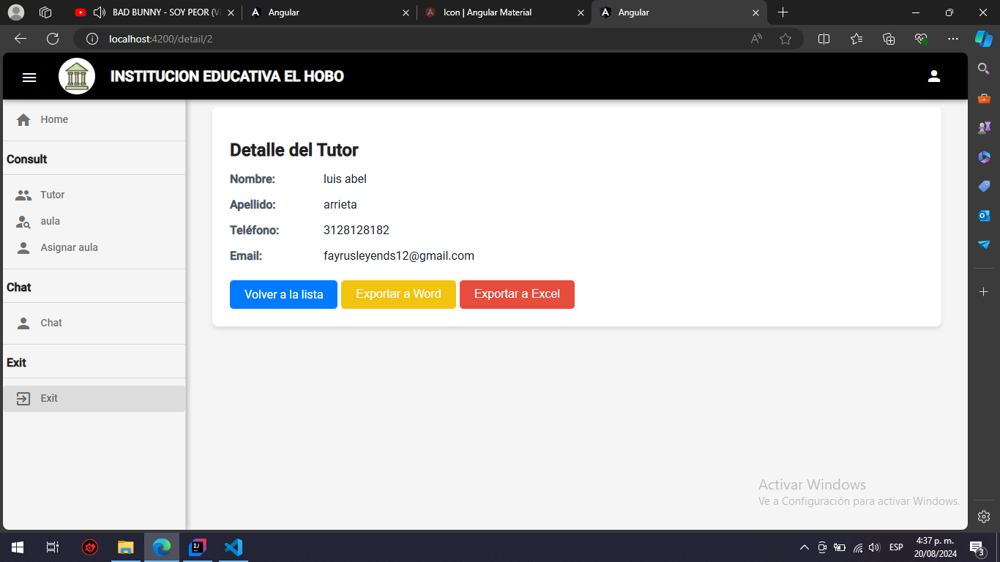
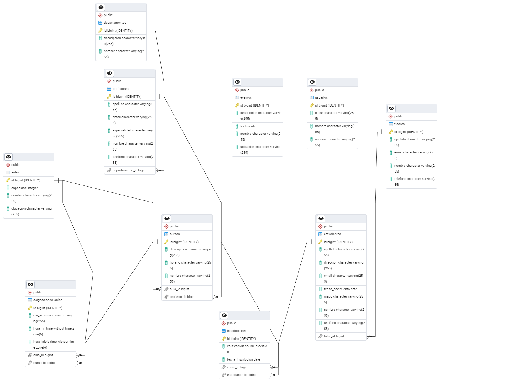

# Institucion educativa el hobo 

Proyecto de aula para una Institucion educativa ubicada en el carmen de bolivar/corregimiento el hobo 

## Tecnologias

Tecnologia utilizada spring boot, angular 13.0.3 postgress 

Estructura base de dato Relacion o ERD

## Inicializacion

cd
npm i
npm start